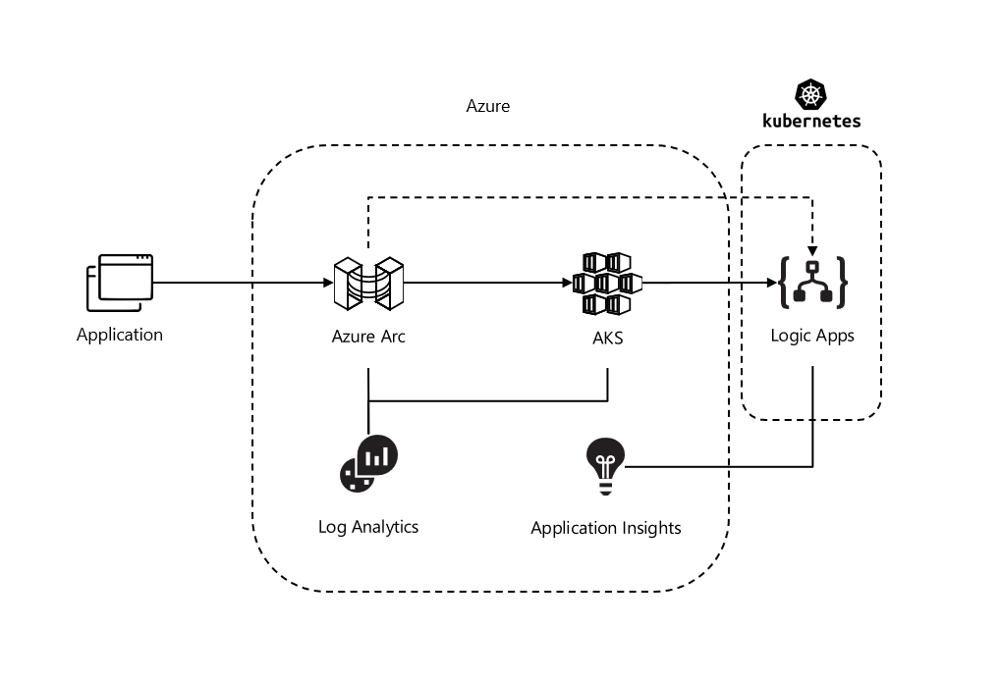

# ais-sync-pattern-la-std-k8s

Running Logic Apps Standard in Kubernetes on-premise or Azure Kubernetes Service managed by Azure Arc.

## Architecture



## Prerequisites

* Install Visual Studio Code [Visual Studio Code](https://code.visualstudio.com/download)
* Install Azure CLI [Azure CLI](https://docs.microsoft.com/nl-nl/cli/azure/install-azure-cli-windows?tabs=azure-cli)
* Install Azure Function Core Tools [Azure Functions Core Tools](https://github.com/Azure/azure-functions-core-tools)
* Install Azure Logic Apps (Standard) Extension for VSCode [Azure Logic Apps (Standard)](https://marketplace.visualstudio.com/items?itemName=ms-azuretools.vscode-azurelogicapps)
* Install Azurite Extension for VSCode to test Logic Apps locally [Azurite](https://marketplace.visualstudio.com/items?itemName=Azurite.azurite)

## Using Azure Kubernetes Service

* Create a resource group for AKS

```ps1
$resourceGroupAks="ais-aks-rg"
az group create --name $resourceGroupAks --location WestEurope --output table
```

* Create AKS Cluster

```ps1
$clusterName="ais-aks"
az aks create --resource-group $resourceGroupAks --name $clusterName --node-count 1 --enable-addons monitoring --generate-ssh-keys
```

* Create a public static ip for AKS

```ps1
$aksComponentsResourceGroupName=$(az aks show --resource-group $resourceGroupAks --name $clusterName --output tsv --query nodeResourceGroup)
$appsvcPipName="$clusterName-appsvc-pip"
az network public-ip create --resource-group $aksComponentsResourceGroupName --name $appsvcPipName --sku STANDARD
$staticIp=$(az network public-ip show --resource-group $aksComponentsResourceGroupName --name $appsvcPipName --output tsv --query ipAddress)
```

* Connect to AKS Cluster

```ps1
az aks install-cli
az aks get-credentials --resource-group $resourceGroupAks --name $clusterName
```

## Providers & Extensions

* Log into Azure CLI and follow the instructions

```ps1
az login
```

* Install Azure CLI extention

```ps1
az extension add --upgrade --yes --name connectedk8s
az extension add --upgrade --yes --name k8s-extension
az extension add --upgrade --yes --name customlocation
az extension add --upgrade --yes --name appservice-kube
```

* Register providers

```ps1
az provider register --namespace Microsoft.Kubernetes --wait
az provider register --namespace Microsoft.KubernetesConfiguration --wait
az provider register --namespace Microsoft.ExtendedLocation --wait
az provider register --namespace Microsoft.Web --wait
az provider register --namespace Microsoft.OperationsManagement --wait
az provider register --namespace Microsoft.OperationalInsights --wait
```

## Setup Azure Arc & connect to Kubernetes cluster

* Create a resource group for Arc

```ps1
$resourceGroupArc="ais-arc-rg"
az group create --name $resourceGroupArc --location WestEurope --output table
```

* Create a resource group for shared services for monitoring

```ps1
$resourceGroupShared="aisshared-rg"
az group create --name $resourceGroupShared --location WestEurope --output table
```

* Create a Log Analytics Workspace for Arc logging

```ps1
$logAnalytics="aisshared-ws"
az monitor log-analytics cluster create -g $resourceGroupShared -n $logAnalytics --sku-capacity 1000
```

* Create Application Insights Service for Logic Apps logging

```ps1
$appInsights="aisshared-ai"
az monitor app-insights component create -g $resourceGroupShared \
   --app appInsights --location westeurope --kind web --application-type web \
   --retention-time 120
```

* Connect an existing Kubernetes Cluster

```ps1
$clusterNameArc="arc-$clusterName"
az connectedk8s connect --name $clusterNameArc --resource-group $resourceGroupArc
```

* Verify cluster connection

```ps1
az connectedk8s list --resource-group $resourceGroupArc --output table
```

* View Arc agents on Kubernetes

```ps1
kubectl get deployments,pods -n azure-arc
```

* Enable feature Custom Locations on Cluster

```ps1
az connectedk8s enable-features -n $clusterNameArc -g $resourceGroupArc --features cluster-connect custom-locations
```

* Create separate namespace & switch context

```ps1
$namespace="appservice"
kubectl create namespace $namespace
kubectl config set-context --current --namespace=$namespace
```

* Install App Service extention

> Keep in mind that it takes some time to deploy the extension (15-20min). At one time the deployment will run into a timeout. Go to the next step to monitor the progress of the deployment. When the deployment is in failed status, that doesn't mean you need to uninstall it and try again. Investigate why the pods in the namespace are in a "Pending" state. Sometimes you just need to scale up a bit to get it running. Check using the describe command below. Also it important to know that Kubenetes will alway try to resolve the issue of the deployment. So, if you fix the issue of the "Pending" pod, don't uninstall, just wait until Kubernetes re-innitiates.

```ps1
kubectl describe pod <pod name>
```

```ps1
$extensionName="$clusterNameArc-appsvc" # Name of the App Service extension
$kubeEnvironmentName="$clusterNameArc-appsvc" # Name of the App Service Kubernetes environment resource
$logAnalyticsWorkspaceId=$(az monitor log-analytics workspace show `
    --resource-group $resourceGroupShared `
    --workspace-name $logAnalytics `
    --query customerId `
    --output tsv)
$logAnalyticsWorkspaceIdEnc=[Convert]::ToBase64String([System.Text.Encoding]::UTF8.GetBytes($logAnalyticsWorkspaceId))
$logAnalyticsKey=$(az monitor log-analytics workspace get-shared-keys `
    --resource-group $resourceGroupShared `
    --workspace-name $logAnalytics `
    --query primarySharedKey `
    --output tsv)
$logAnalyticsKeyEnc=[Convert]::ToBase64String([System.Text.Encoding]::UTF8.GetBytes($logAnalyticsKey))

az k8s-extension create `
    --resource-group $resourceGroupArc `
    --name $extensionName `
    --cluster-type connectedClusters `
    --cluster-name $clusterNameArc `
    --extension-type 'Microsoft.Web.Appservice' `
    --release-train stable `
    --auto-upgrade-minor-version true `
    --scope cluster `
    --release-namespace $namespace `
    --configuration-settings "Microsoft.CustomLocation.ServiceAccount=default" `
    --configuration-settings "appsNamespace=${namespace}" `
    --configuration-settings "clusterName=${kubeEnvironmentName}" `
    --configuration-settings "loadBalancerIp=${staticIp}" `
    --configuration-settings "keda.enabled=true" `
    --configuration-settings "buildService.storageClassName=default" `
    --configuration-settings "buildService.storageAccessMode=ReadWriteOnce" `
    --configuration-settings "customConfigMap=${namespace}/kube-environment-config" `
    --configuration-settings "envoy.annotations.service.beta.kubernetes.io/azure-load-balancer-resource-group=${resourceGroupAks}" `
    --configuration-settings "logProcessor.appLogs.destination=log-analytics" `
    --configuration-protected-settings "logProcessor.appLogs.logAnalyticsConfig.customerId=${logAnalyticsWorkspaceIdEnc}" `
    --configuration-protected-settings "logProcessor.appLogs.logAnalyticsConfig.sharedKey=${logAnalyticsKeyEnc}"
```

* Monitor the App Service extention deployment & fetch the extensionId

```ps1
$extensionId=$(az k8s-extension show `
    --cluster-type connectedClusters `
    --cluster-name $clusterNameArc `
    --resource-group $resourceGroupArc `
    --name $extensionName `
    --query id `
    --output tsv)
az resource wait --ids $extensionId --custom "properties.installState!='Pending'" --api-version "2020-07-01-preview"
kubectl get pods -n $namespace
```

* Create a Custom Location

```ps1
$customLocationName="$clusterNameArc-appsvc" # Name of the custom location
$connectedClusterId=$(az connectedk8s show --resource-group $resourceGroupArc --name $clusterNameArc --query id --output tsv)
az customlocation create `
    --resource-group $resourceGroupArc `
    --name $customLocationName `
    --host-resource-id $connectedClusterId `
    --namespace $namespace `
    --cluster-extension-ids $extensionId
```

* Get Custom Location Id

```ps1
$customLocationId=$(az customlocation show --resource-group $resourceGroupArc `
    --name $customLocationName `
    --query id `
    --output tsv)
echo $customLocationId
```

* Create the App Service Kubernetes environment

```ps1
az appservice kube create `
    --resource-group $resourceGroupArc `
    --name $kubeEnvironmentName `
    --custom-location $customLocationId `
    --static-ip $staticIp
az appservice kube show --resource-group $resourceGroupArc --name $kubeEnvironmentName
```

## Deploy your Logic App to your Custom Location

Now everything is setup to follow the normal process of deploying your Logic App Standard to the new location.
-Create a Logic App by creating a new project
-Develop your Logic App using builtin designer
-Right-click on this Project, deploy to Logic Apps, and deploy the hello-world-wf I've created as an example.
-When choosing the Location, search for your Custom Location in Regions List.
